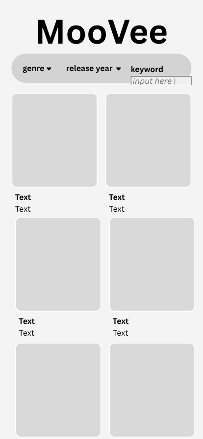

# **MooVee**

## Table of Contents

1. [App Overview](#App-Overview)
1. [Product Spec](#Product-Spec)
1. [Wireframes](#Wireframes)
1. [Build Notes](#Build-Notes)

## App Overview

### Description

This app recommends a random movie to watch.

### App Evaluation

<!-- Evaluation of your app across the following attributes -->

- **Category:** Entertainment
- **Mobile:** Highly visual experience with movie posters, trailers, and touch-based interactions. More engaging on mobile than a simple website, especially if paired with personalization or swipe-based UI (e.g. like/dislike system).
- **Story:** Very relatable. Everyone has wanted help picking a movie. It’s easy to pitch to friends, and the value is clear—solving choice fatigue. Strong "daily life companion" vibe.
- **Market:** Movie fans or people looking for something to watch will use this app.
- **Habit:** Users can use this app whenever they want entertainment.
- **Scope:** Not too technically challenging

## Product Spec

### 1. User Features (Required and Optional)

Required Features:

- browse movies based on:
    - genre (drop down)
    - release year (drop down)
    - keyword (text input)
- invoke the api when its clicked
- 3 filters at the top
- default (release year = 2025)

Stretch Features:

- TV Shows
- More filters

### 2. Chosen API(s)

- https://developer.themoviedb.org/reference/genre-movie-list
    - **list associated required feature here**
    - ...
- ...

### 3. User Interaction

Required Features

- genre drop down menu --> choose a genre
- year drop down menu --> choose a year
- type in keyword --> saves keyword
- click "filter button" --> filters based on genre, year, keyword selections

## Wireframes

<!-- Add picture of your hand sketched wireframes in this section -->

### [BONUS] Digital Wireframes & Mockups

### [BONUS] Interactive Prototype

## Build Notes

Here's a place for any other notes on the app, it's creation
process, or what you learned this unit!

For Milestone 2, include **2+ Videos/GIFs** of the build process here!

## License

Copyright **yyyy** **Sai, Kris, Ruthie, Evan**

Licensed under the Apache License, Version 2.0 (the "License");
you may not use this file except in compliance with the License.
You may obtain a copy of the License at

    http://www.apache.org/licenses/LICENSE-2.0

Unless required by applicable law or agreed to in writing, software
distributed under the License is distributed on an "AS IS" BASIS,
WITHOUT WARRANTIES OR CONDITIONS OF ANY KIND, either express or implied.
See the License for the specific language governing permissions and
limitations under the License.